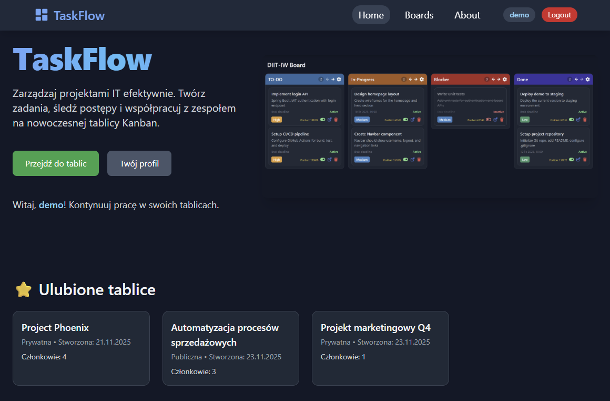
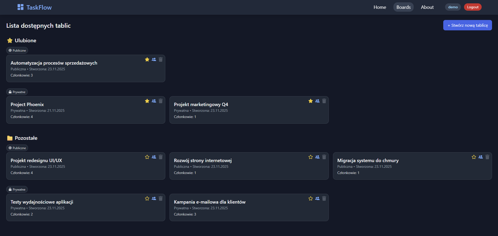
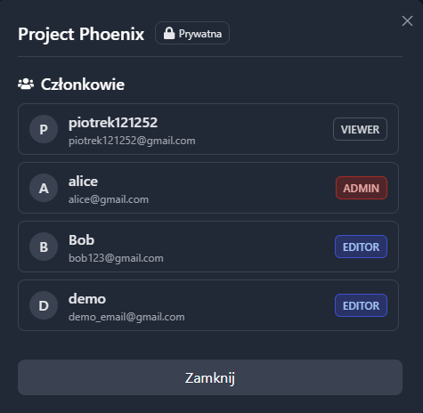
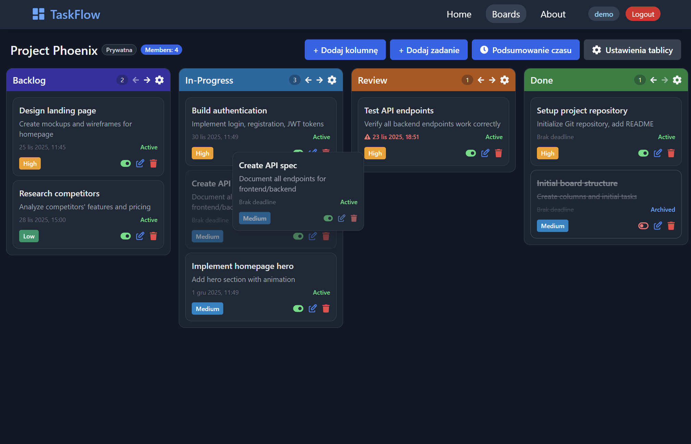
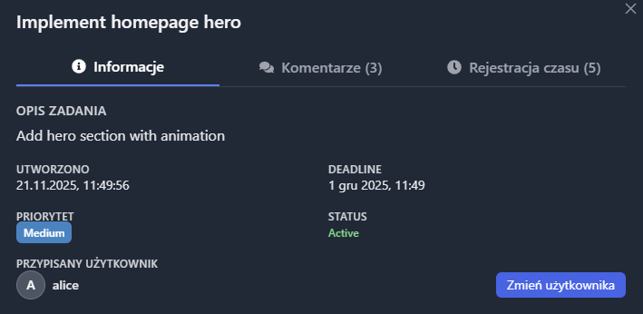
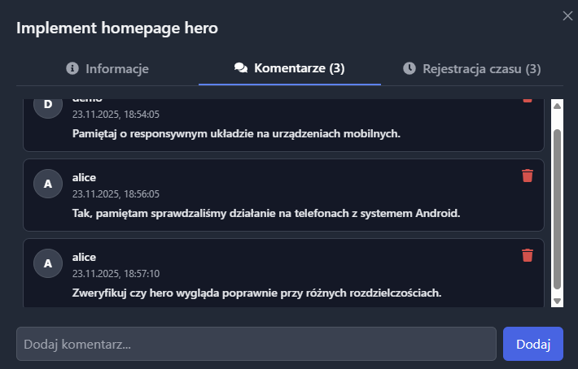
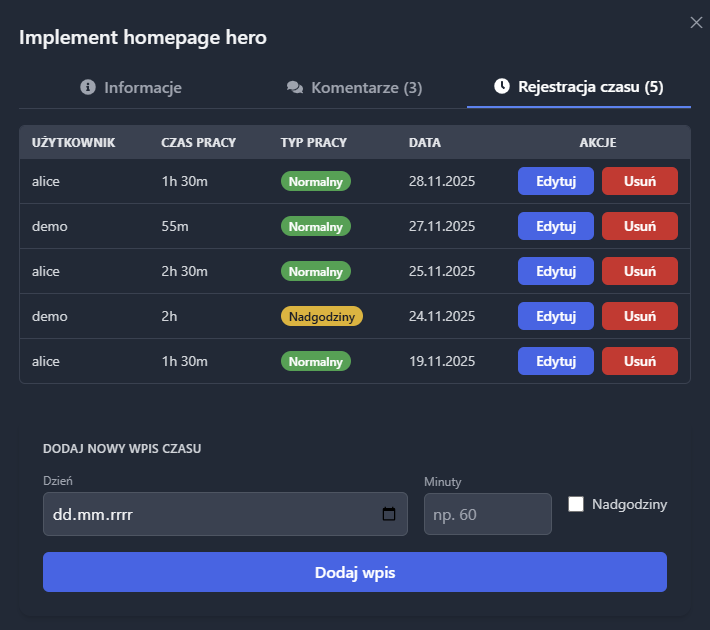
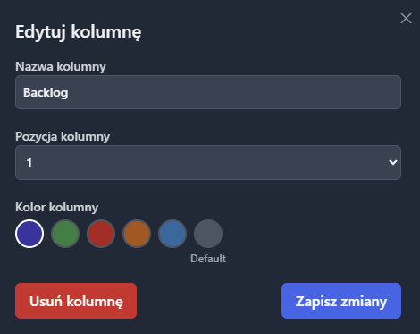
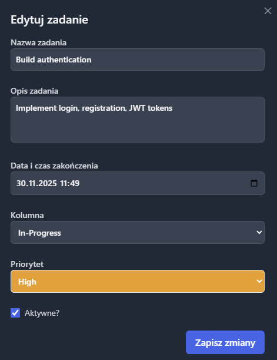
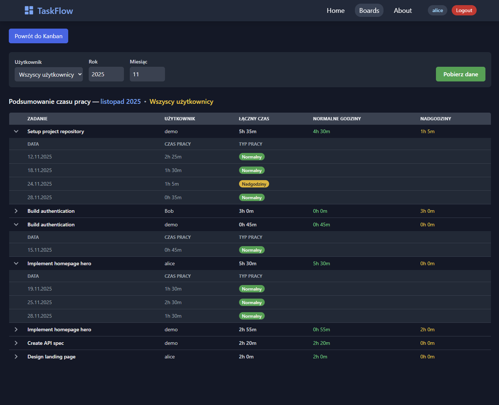

# TaskFlow

---

Aplikacja webowa wspomagająca zarządzanie projektami informatycznymi oparta o tablice Kanban. Umożliwia organizację zadań, śledzenie postępu, logowanie czasu pracy oraz wyświetlenie miesięcznych podsumowań.

### Kluczowe funkcje

---

- Rejestracja i logowanie użytkowników z wykorzystaniem JWT
- Tworzenie tablic (projektów) i zarządzanie ich zawartością
- Dodawanie, edytowanie i usuwanie kolumn oraz zadań
- Przypisywanie użytkowników do zadań oraz dodawanie komentarzy
- Przenoszenie zadań metodą drag & drop z obsługą myszy i klawiatury
- Nadawanie ról członkom tablic i zarządzanie ich uprawnieniami
- Oznaczanie tablic jako ulubione
- Logowanie czasu pracy w zadaniach z rozróżnieniem typów pracy
- Generowanie miesięcznych podsumowań czasu pracy dla projektu
- Współpraca użytkowników w tablicach prywatnych i publicznych

### Wykorzystane technologie

---

#### **Frontend**

- React
- TailwindCSS
- React Router
- Axios
- dnd-kit

#### **Backend**

- Java 17
- Spring Boot 3.5.7
- Spring Data JPA + Hibernate
- Maven
- Docker
- PostgreSQL

### Projekt Strony

---

Strona Główna

Lista dostępnych tablic

Lista użytkowników

Tablica Kanban

Szczegółowe informacje o zadaniu

Komentarze pod zadaniem

Dodawanie wpisów czasu pracy

Edycja kolumny

Edycja zadania

Podsumowanie czasu pracy

Aplikacja stworzona przez: Piotr Komarnicki
